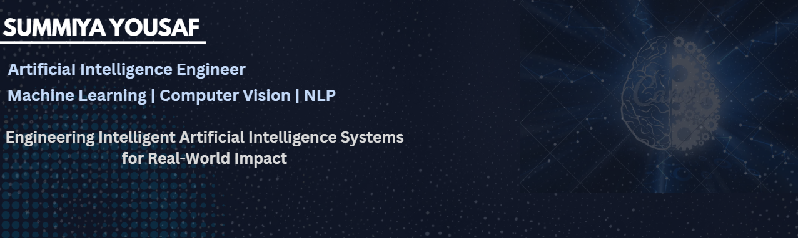

  

 ##  About Me
 BSAI student @Air University Islamabad

As a BSAI student at Air University Islamabad, I enjoy building AI-powered applications that solve real-world problems through machine learning and data-driven solutions. My interests include Machine Learning, Computer Vision, Natural Language Processing, and Healthcare AI, where I transform ideas into practical applications through hands-on projects.

##  Tech Stack

  

### Libraries & Tools

  
  
  

## Certifications

🏅 Harvard CS50P – Introduction to Programming with Python 

🏅 Deloitte Data Analytics Virtual Job Simulation

🏅 Kaggle Machine Learning Certificate

##  Experience

### Machine Learning Intern | Arc Technologies
📅 July 2026 - August 2026

### Artificial Intelligence Intern | DecodeLabs
📅 17th July 2026 - 17th August 2026

##  Featured Projects

A selection of projects showcasing my interest in Artificial Intelligence, Machine Learning, and Web Development.

### AI Medical Assistant

Machine Learning • Flask • Healthcare AI

An AI-powered healthcare assistant that predicts diseases from user symptoms using machine learning models and provides an interactive web interface built with Flask.

### Space AI Chatbot

Flask • REST APIs • Conversational AI

An intelligent chatbot that delivers real-time space information by integrating NASA, Open Notify, and SpaceX APIs, with voice interaction and a responsive web interface.

##  GitHub Stats

  
  

## Contribution Graph

  <picture>
    <source media="(prefers-color-scheme: dark)" srcset="https://raw.githubusercontent.com/summiyahyousaf/summiyahyousaf/output/github-contribution-grid-snake-dark.svg" />
    <source media="(prefers-color-scheme: light)" srcset="https://raw.githubusercontent.com/summiyahyousaf/summiyahyousaf/output/github-contribution-grid-snake.svg" />
    
  </picture>

###  Connect With Me

